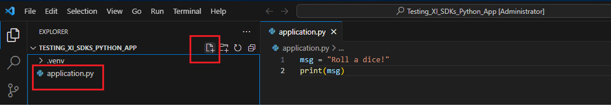
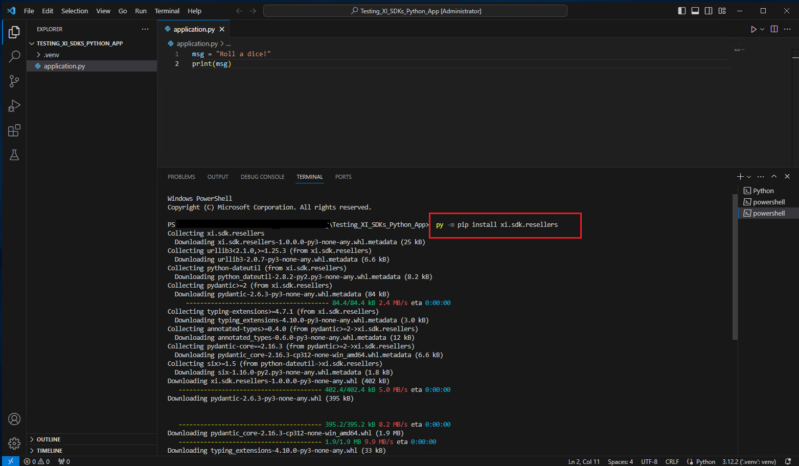
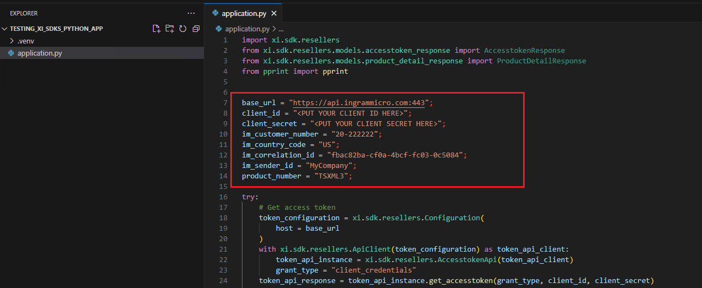
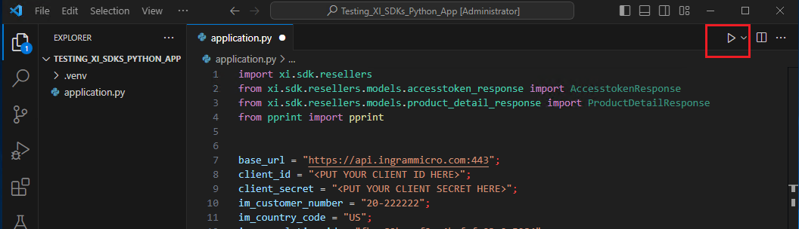
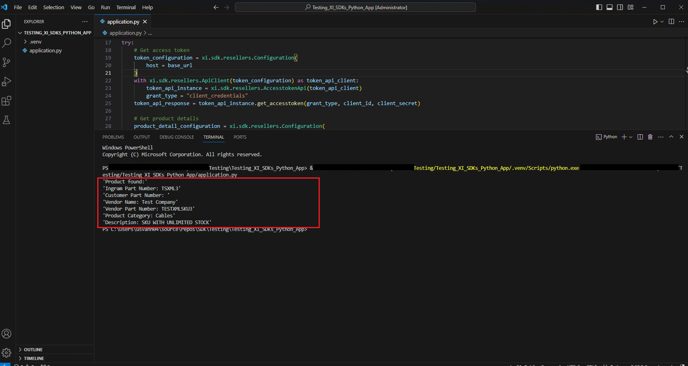

# XI SDK Quickstart for C#


[Repository GitHub](https://github.com/ingrammicro-xvantage/xi-sdk-resellers-python)

[SDK document](https://github.com/ingrammicro-xvantage/xi-sdk-resellers-python/tree/main/docs)

### Step 1: Create a new python application 
* You can create a new python application with your preferred tool. The below guide is using [VS Code](https://code.visualstudio.com/Download). if you don’t have the environment set up yet, please follow [this guide](https://code.visualstudio.com/docs/python/python-tutorial) to install and set up python environment for VS Code.
* Create a folder for the application: `Testing_XI_SDKs_Python_App`
* Open VS code and point to the above folder.
* Hover to the root folder name on the left panel and click `create new file` icon.
* Create `application.py` file under the new folder.



### Step 2: Install XI SDK package and all dependencies to your project from Pip

* Open a new terminal window (`Ctrl+Shift+` ```)
* Type: `py -m pip install xi.sdk.resellers` (If you receive “command not found” error, please make sure to install all the prerequisites from the above [guide](https://code.visualstudio.com/docs/python/python-tutorial))



### Step 3: Write a simple code to access the access token and product details endpoints.

[Access Token API](https://github.com/ingrammicro-xvantage/xi-sdk-resellers-python/blob/main/docs/AccesstokenApi.md#getaccesstoken)

[Product API](https://github.com/ingrammicro-xvantage/xi-sdk-resellers-python/blob/main/docs/ProductCatalogApi.md)

* Open the application.cs file and paste the following code.

```python
import xi.sdk.resellers
from xi.sdk.resellers.models.accesstoken_response import AccesstokenResponse
from xi.sdk.resellers.models.product_detail_response import ProductDetailResponse
from pprint import pprint


base_url = "https://api.ingrammicro.com:443"
client_id = "<PUT YOUR CLIENT ID HERE>"
client_secret = "<PUT YOUR CLIENT SECRET HERE>"
im_customer_number = "20-222222"
im_country_code = "US"
im_correlation_id = "fbac82ba-cf0a-4bcf-fc03-0c5084"
im_sender_id = "MyCompany"
product_number = "TSXML3"

try:
    # Get access token
    token_configuration = xi.sdk.resellers.Configuration(
        host = base_url
    )
    with xi.sdk.resellers.ApiClient(token_configuration) as token_api_client:
        token_api_instance = xi.sdk.resellers.AccesstokenApi(token_api_client)
        grant_type = "client_credentials"
    token_api_response = token_api_instance.get_accesstoken(grant_type, client_id, client_secret)

    # Get product details
    product_detail_configuration = xi.sdk.resellers.Configuration(
        host = base_url
    )
    product_detail_configuration.access_token = token_api_response.access_token
    with xi.sdk.resellers.ApiClient(product_detail_configuration) as product_api_client:
        product_api_instance = xi.sdk.resellers.ProductCatalogApi(product_api_client)
    product_api_response = product_api_instance.get_reseller_v6_productdetail(product_number, im_customer_number, im_country_code, im_correlation_id, im_sender_id=im_sender_id)
    pprint("Product found:")
    pprint("Ingram Part Number: " + product_api_response.ingram_part_number)
    pprint("Customer Part Number: " + product_api_response.customer_part_number)
    pprint("Vendor Name: " + product_api_response.vendor_name)
    pprint("Vendor Part Number: " + product_api_response.vendor_part_number)
    pprint("Product Category: " + product_api_response.product_category)
    pprint("Description: " + product_api_response.description)
except Exception as e:
    pprint("Exception when calling ProductCatalogApi->get_reseller_v6_productdetail: %s\n" % e)
```

* Replace your application information at the below section in the code:
    * Client ID 
    * Client Secret.
    * Your IM customer number
    * Your country code
    * Your Correlation ID
    * Your Sender ID
    * Product number to get the details.



### Step 4: Run the application

* Clicking on the run icon on the top right corner of the `application.py` file.



If everything is correct and the product exists, the console should return something like this.



 